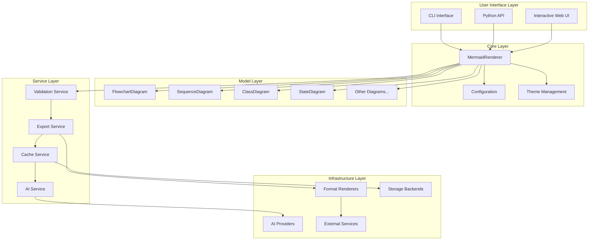
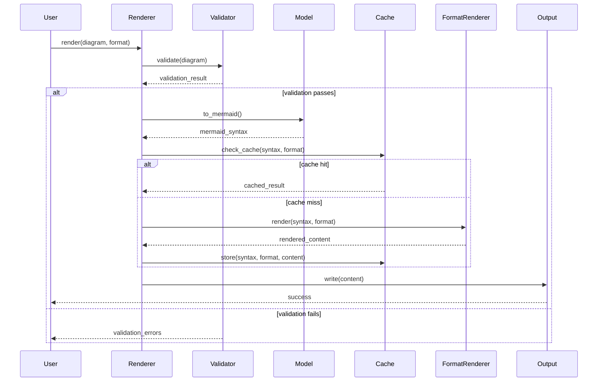
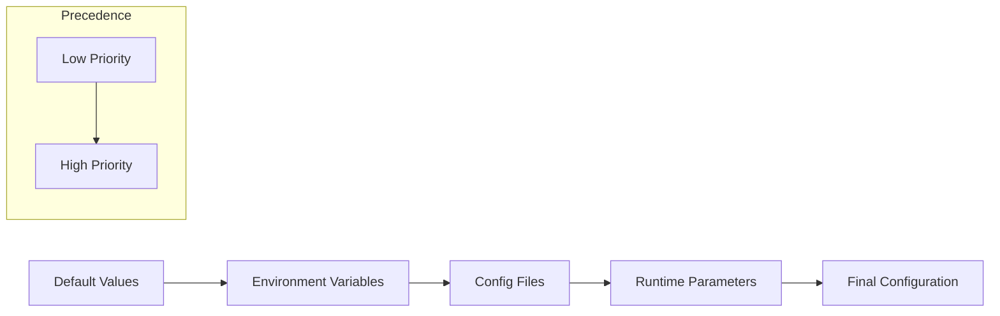

# Architecture Documentation

## Overview

Mermaid Render is a comprehensive Python library designed with a modular, extensible architecture that supports multiple diagram types, rendering formats, and advanced features. The library follows clean architecture principles with clear separation of concerns and well-defined interfaces.

## System Architecture



## Core Components

### 1. Core Layer

#### MermaidRenderer
The central rendering engine that orchestrates the entire rendering process.

**Responsibilities:**
- Coordinate diagram rendering pipeline
- Apply themes and configuration
- Handle format conversion
- Manage error handling and recovery

**Key Methods:**
- `render()`: Main rendering method
- `save()`: Render and save to file
- `set_theme()`: Apply themes

#### Configuration System
Hierarchical configuration management with multiple sources.

**Configuration Sources (in order of precedence):**
1. Runtime parameters (highest)
2. Environment variables
3. Configuration files
4. Default values (lowest)

**Key Classes:**
- `MermaidConfig`: Core configuration
- `ConfigManager`: Advanced configuration management

#### Theme Management
Comprehensive theming system supporting built-in and custom themes.

**Features:**
- Built-in theme collection
- Custom theme support
- Theme validation
- Dynamic theme loading

### 2. Model Layer

The model layer provides object-oriented interfaces for creating different types of diagrams.

#### Base Classes
- `MermaidDiagram`: Abstract base for all diagram types
- Provides common functionality: validation, configuration, serialization

#### Diagram Types
Each diagram type has specialized classes for elements:

**FlowchartDiagram:**
- `FlowchartNode`: Individual nodes with shapes and styling
- `FlowchartEdge`: Connections between nodes
- `FlowchartSubgraph`: Grouped elements

**SequenceDiagram:**
- `SequenceParticipant`: Actors in the sequence
- `SequenceMessage`: Communications between participants
- `SequenceNote`: Annotations and comments

**ClassDiagram:**
- `ClassDefinition`: Class structures
- `ClassMethod`: Method definitions
- `ClassAttribute`: Property definitions
- `ClassRelationship`: Inheritance and associations

### 3. Service Layer

#### Validation Service
Comprehensive syntax and semantic validation.

**Features:**
- Mermaid syntax validation
- Semantic correctness checking
- Error reporting with line numbers
- Suggestion generation

#### Export Service
Multi-format export capabilities.

**Supported Formats:**
- SVG: Vector graphics for web
- PNG: Raster images for documents
- PDF: Print-ready documents

**Features:**
- Batch export
- Multi-format export
- Custom sizing and quality

#### Cache Service
Performance optimization through intelligent caching.

**Cache Backends:**
- Memory: Fast in-process caching
- File: Persistent disk-based caching
- Redis: Distributed caching for scalability

**Features:**
- Automatic cache invalidation
- Performance monitoring
- Cache warming strategies

#### AI Service
Advanced AI-powered features for diagram generation and optimization.

**Capabilities:**
- Natural language to diagram conversion
- Diagram optimization and layout
- Smart suggestions and improvements
- Automated diagram generation

## Data Flow

### Rendering Pipeline



### Configuration Loading



## Extension Points

### Custom Diagram Types

To add a new diagram type:

1. Inherit from `MermaidDiagram`
2. Implement required abstract methods
3. Define element classes (nodes, edges, etc.)
4. Add to model registry

```python
class CustomDiagram(MermaidDiagram):
    def get_diagram_type(self) -> str:
        return "custom"
    
    def to_mermaid(self) -> str:
        # Generate Mermaid syntax
        pass
```

### Custom Renderers

To add support for new output formats:

1. Implement renderer interface
2. Register with renderer factory
3. Handle format-specific options

```python
class CustomRenderer:
    def render(self, mermaid_code: str, **options) -> bytes:
        # Custom rendering logic
        pass
```

### Custom Themes

Themes can be extended through:

1. JSON theme files
2. Programmatic theme creation
3. Theme inheritance and composition

### AI Providers

New AI providers can be added by:

1. Implementing the `AIProvider` interface
2. Registering with the provider factory
3. Configuring authentication and endpoints

## Performance Considerations

### Caching Strategy

- **Diagram-level caching**: Cache rendered diagrams by content hash
- **Component-level caching**: Cache individual diagram elements
- **Template caching**: Cache frequently used diagram templates

### Memory Management

- **Lazy loading**: Load components only when needed
- **Resource pooling**: Reuse expensive resources
- **Garbage collection**: Proper cleanup of temporary resources

### Scalability

- **Horizontal scaling**: Support for distributed caching
- **Load balancing**: Multiple rendering service instances
- **Rate limiting**: Prevent resource exhaustion

## Security Considerations

### Input Validation

- Strict validation of all user inputs
- Sanitization of diagram content
- Protection against injection attacks

### Resource Limits

- Maximum diagram size limits
- Rendering timeout controls
- Memory usage monitoring

### External Services

- Secure communication with rendering services
- API key management
- Rate limiting and quotas

## Testing Strategy

### Unit Tests
- Individual component testing
- Mock external dependencies
- Edge case coverage

### Integration Tests
- End-to-end rendering pipeline
- External service integration
- Performance benchmarks

### Quality Assurance
- Code coverage monitoring
- Static analysis
- Security scanning

## Deployment Patterns

### Standalone Library
- Direct Python package installation
- Local rendering capabilities
- Minimal dependencies

### Service-Oriented
- Microservice architecture
- API-based rendering
- Scalable deployment

### Hybrid Approach
- Local rendering with cloud fallback
- Caching for performance
- Offline capability

## Future Enhancements

### Planned Features
- Real-time collaborative editing
- Advanced AI capabilities
- Additional diagram types
- Enhanced theming system

### Extensibility
- Plugin architecture
- Custom element types
- Advanced styling options
- Integration APIs
