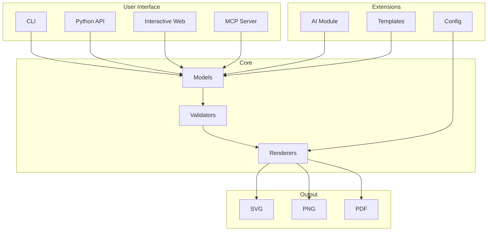

# Architecture Overview

This section provides detailed documentation about the internal architecture and module structure of Mermaid Render.

## Module Structure

Mermaid Render is organized into several specialized modules:

| Module | Description |
|--------|-------------|
| [AI](modules/ai.md) | AI-powered features including natural language processing and diagram generation |
| [Config](modules/config.md) | Configuration management and theme settings |
| [Interactive](modules/interactive.md) | Web-based interactive diagram builder |
| [MCP](modules/mcp.md) | Model Context Protocol server implementation |
| [Models](modules/models.md) | Object-oriented diagram model classes |
| [Renderers](modules/renderers.md) | Plugin-based renderer system for multiple output formats |
| [Templates](modules/templates.md) | Template system for generating diagrams from data |
| [Utils](modules/utils.md) | Utility functions and helper classes |
| [Validators](modules/validators.md) | Comprehensive validation capabilities |

## High-Level Architecture

## Design Principles

1. **Modularity**: Each module is self-contained with clear interfaces
2. **Extensibility**: Plugin-based architecture for renderers and validators
3. **Type Safety**: Full type hints throughout the codebase
4. **Performance**: Caching and optimization at multiple levels
5. **Testability**: Comprehensive test coverage with isolated unit tests
