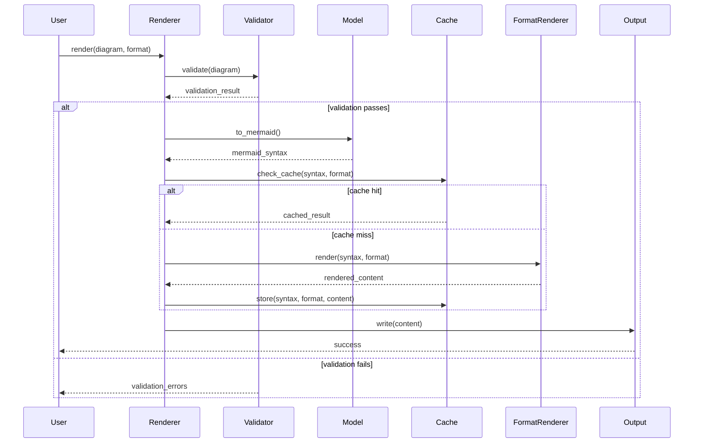
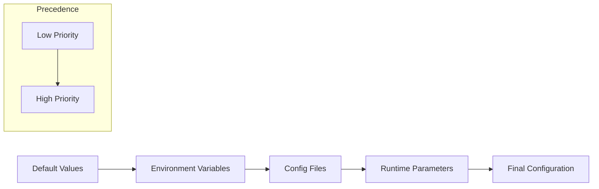

# Architecture Overview

## Overview

Mermaid Render is a comprehensive Python library designed with a modular, extensible architecture that supports multiple diagram types, rendering formats, and advanced features. The library follows clean architecture principles with clear separation of concerns and well-defined interfaces.

**Key Architectural Patterns:**

- **Plugin Registry Pattern**: Renderers register themselves with RendererRegistry, enabling runtime discovery and dynamic fallback chains
- **Chain of Responsibility**: RendererManager tries multiple renderers in sequence if primary fails
- **Template Method**: BaseRenderer defines rendering skeleton; subclasses implement specifics
- **Factory**: RendererRegistry creates renderer instances based on requirements
- **Strategy**: Different cache backends and AI providers implement common interfaces
- **Facade**: MermaidRenderer simplifies complex plugin system for basic use cases

## System Architecture

```mermaid
graph TB
    subgraph "User Interface Layer"
        CLI[CLI Interface]
        API[Python API]
        Interactive[Interactive Web UI]
        MCP[MCP Server]
    end

    subgraph "Core Layer"
        Renderer[MermaidRenderer]
        PluginRenderer[PluginMermaidRenderer]
        Config[Configuration]
        Themes[Theme Management]
    end

    subgraph "Model Layer"
        Flowchart[FlowchartDiagram]
        Sequence[SequenceDiagram]
        Class[ClassDiagram]
        State[StateDiagram]
        Timeline[TimelineDiagram]
        Other[Other Diagrams...]
    end

    subgraph "Service Layer"
        Validation[Validation Service]
        Export[Export Service]
        Cache[Cache Service]
        AI[AI Service]
        Templates[Template Service]
    end

    subgraph "Infrastructure Layer"
        RendererRegistry[Renderer Registry]
        RendererManager[Renderer Manager]
        SVGRenderer[SVG Renderer]
        PNGRenderer[PNG Renderer]
        PDFRenderer[PDF Renderer]
        PlaywrightRenderer[Playwright Renderer]
        NodeJSRenderer[Node.js Renderer]
        GraphvizRenderer[Graphviz Renderer]
        Storage[Storage Backends]
        Providers[AI Providers]
    end

    CLI --> Renderer
    API --> Renderer
    Interactive --> PluginRenderer
    MCP --> PluginRenderer

    Renderer --> Config
    Renderer --> Themes
    PluginRenderer --> RendererManager

    RendererManager --> RendererRegistry
    RendererRegistry --> SVGRenderer
    RendererRegistry --> PNGRenderer
    RendererRegistry --> PDFRenderer
    RendererRegistry --> PlaywrightRenderer
    RendererRegistry --> NodeJSRenderer
    RendererRegistry --> GraphvizRenderer

    Renderer --> Flowchart
    Renderer --> Sequence
    Renderer --> Class
    Renderer --> State
    Renderer --> Timeline
    Renderer --> Other

    Validation --> Export
    Export --> Cache
    Cache --> AI
    AI --> Templates

    Cache --> Storage
    AI --> Providers
```



## Core Components

### 1. Core Layer

#### MermaidRenderer

The central rendering engine that orchestrates the entire rendering process.

**Responsibilities:**

- Coordinate diagram rendering pipeline
- Apply themes and configuration
- Handle format conversion
- Manage error handling and recovery

**Key Methods:**

- `render()`: Main rendering method
- `save()`: Render and save to file
- `set_theme()`: Apply themes

#### PluginMermaidRenderer

Advanced renderer with plugin-based architecture and automatic fallback.

**Responsibilities:**

- Manage multiple rendering backends
- Automatic renderer selection based on format and availability
- Fallback chain execution when primary renderer fails
- Health monitoring and benchmarking

**Key Methods:**

- `render()`: Render with automatic backend selection
- `get_available_renderers()`: List available rendering backends
- `get_renderer_status()`: Get health status of all renderers
- `benchmark_renderers()`: Performance comparison of renderers

#### Configuration System

Hierarchical configuration management with multiple sources.

**Configuration Sources (in order of precedence):**

1. Runtime parameters (highest)
2. Environment variables
3. Configuration files
4. Default values (lowest)

**Key Classes:**

- `MermaidConfig`: Core configuration
- `ConfigManager`: Advanced configuration management

#### Theme Management

Comprehensive theming system supporting built-in and custom themes.

**Features:**

- Built-in theme collection
- Custom theme support
- Theme validation
- Dynamic theme loading

### 2. Model Layer

The model layer provides object-oriented interfaces for creating different types of diagrams.

#### Base Classes

- `MermaidDiagram`: Abstract base for all diagram types
- Provides common functionality: validation, configuration, serialization

#### Diagram Types

Each diagram type has specialized classes for elements:

**FlowchartDiagram:**

- `FlowchartNode`: Individual nodes with shapes and styling
- `FlowchartEdge`: Connections between nodes
- `FlowchartSubgraph`: Grouped elements

**SequenceDiagram:**

- `SequenceParticipant`: Actors in the sequence
- `SequenceMessage`: Communications between participants
- `SequenceNote`: Annotations and comments

**ClassDiagram:**

- `ClassDefinition`: Class structures
- `ClassMethod`: Method definitions
- `ClassAttribute`: Property definitions
- `ClassRelationship`: Inheritance and associations

### 3. Service Layer

#### Validation Service

Comprehensive syntax and semantic validation.

**Features:**

- Mermaid syntax validation
- Semantic correctness checking
- Error reporting with line numbers
- Suggestion generation

#### Export Service

Multi-format export capabilities.

**Supported Formats:**

- SVG: Vector graphics for web
- PNG: Raster images for documents
- PDF: Print-ready documents

**Features:**

- Batch export
- Multi-format export
- Custom sizing and quality

#### Cache Service

Performance optimization through intelligent caching.

**Cache Backends:**

- Memory: Fast in-process caching
- File: Persistent disk-based caching
- Redis: Distributed caching for scalability

**Features:**

- Automatic cache invalidation
- Performance monitoring
- Cache warming strategies

#### AI Service

Advanced AI-powered features for diagram generation and optimization.

**Capabilities:**

- Natural language to diagram conversion
- Diagram optimization and layout
- Smart suggestions and improvements
- Automated diagram generation
- Multi-provider support (OpenAI, Anthropic, OpenRouter)

**Key Classes:**

- `DiagramGenerator`: Generate diagrams from text descriptions
- `DiagramAnalyzer`: Analyze diagram quality and complexity
- `DiagramOptimizer`: Optimize diagram layout and structure
- `SuggestionEngine`: Generate improvement suggestions
- `NLProcessor`: Natural language processing for intent classification

#### Template Service

Template-based diagram generation from data sources.

**Capabilities:**

- Pre-built templates for common patterns
- Custom template creation
- Data source integration (JSON, CSV, Database, API)
- Template validation and schema checking

**Key Classes:**

- `TemplateManager`: Manage and generate from templates
- `FlowchartGenerator`, `SequenceGenerator`, etc.: Specialized generators
- `JSONDataSource`, `CSVDataSource`, `DatabaseDataSource`: Data loading

#### MCP Service

Model Context Protocol server for AI assistant integration.

**Capabilities:**

- Expose rendering tools to AI assistants
- Template and AI tool integration
- Resource and prompt management
- Real-time diagram generation

**Key Components:**

- `create_mcp_server()`: Server factory
- Tool registrations for render, validate, generate
- Prompt templates for diagram generation
- Resource providers for themes and templates

## Data Flow

### Rendering Pipeline



### Configuration Loading



## Extension Points

### Custom Diagram Types

To add a new diagram type:

1. Inherit from `MermaidDiagram`
2. Implement required abstract methods
3. Define element classes (nodes, edges, etc.)
4. Add to model registry

```python
class CustomDiagram(MermaidDiagram):
    def get_diagram_type(self) -> str:
        return "custom"

    def to_mermaid(self) -> str:
        # Generate Mermaid syntax
        pass
```

### Custom Renderers

To add support for new output formats using the plugin architecture:

1. Inherit from `BaseRenderer`
2. Implement required abstract methods
3. Register with `RendererRegistry`
4. Define capabilities and health checks

```python
from diagramaid.renderers import BaseRenderer, RendererCapability, RendererInfo

class CustomRenderer(BaseRenderer):
    @classmethod
    def get_info(cls) -> RendererInfo:
        return RendererInfo(
            name="custom",
            description="Custom renderer",
            capabilities=[RendererCapability.SVG, RendererCapability.PNG],
            priority=50
        )

    def render(self, mermaid_code: str, format: str, **options) -> bytes:
        # Custom rendering logic
        pass

    def check_health(self) -> bool:
        # Return True if renderer is available
        return True

# Register with global registry
from diagramaid.renderers import register_renderer
register_renderer(CustomRenderer)
```

### Custom Themes

Themes can be extended through:

1. JSON theme files
2. Programmatic theme creation
3. Theme inheritance and composition

### AI Providers

New AI providers can be added by:

1. Implementing the `AIProvider` interface
2. Registering with the provider factory
3. Configuring authentication and endpoints

## Performance Considerations

### Caching Strategy

- **Diagram-level caching**: Cache rendered diagrams by content hash
- **Component-level caching**: Cache individual diagram elements
- **Template caching**: Cache frequently used diagram templates

### Memory Management

- **Lazy loading**: Load components only when needed
- **Resource pooling**: Reuse expensive resources
- **Garbage collection**: Proper cleanup of temporary resources

### Scalability

- **Horizontal scaling**: Support for distributed caching
- **Load balancing**: Multiple rendering service instances
- **Rate limiting**: Prevent resource exhaustion

## Security Considerations

### Input Validation

- Strict validation of all user inputs
- Sanitization of diagram content
- Protection against injection attacks

### Resource Limits

- Maximum diagram size limits
- Rendering timeout controls
- Memory usage monitoring

### External Services

- Secure communication with rendering services
- API key management
- Rate limiting and quotas

## Testing Strategy

### Unit Tests

- Individual component testing
- Mock external dependencies
- Edge case coverage

### Integration Tests

- End-to-end rendering pipeline
- External service integration
- Performance benchmarks

### Quality Assurance

- Code coverage monitoring
- Static analysis
- Security scanning

## Deployment Patterns

### Standalone Library

- Direct Python package installation
- Local rendering capabilities
- Minimal dependencies

### Service-Oriented

- Microservice architecture
- API-based rendering
- Scalable deployment

### Hybrid Approach

- Local rendering with cloud fallback
- Caching for performance
- Offline capability

## Module Interaction Flow

```
User Code
  ↓
MermaidRenderer (facade) or PluginMermaidRenderer
  ↓
RendererManager (orchestration)
  ↓
RendererRegistry (discovery) → BaseRenderer implementations
  ↓
Validation → Caching → Actual rendering backend
```

## Available Renderers

| Renderer | Description | Formats | Dependencies |
|----------|-------------|---------|--------------|
| **SVG** | Default web-based renderer using mermaid.ink | SVG | requests |
| **PNG** | Web-based PNG renderer | PNG | requests |
| **PDF** | PDF converter from SVG | PDF | cairosvg |
| **Playwright** | High-fidelity browser-based renderer | SVG, PNG, PDF | playwright |
| **Node.js** | Local Mermaid CLI renderer | SVG, PNG, PDF | Node.js + @mermaid-js/mermaid-cli |
| **Graphviz** | Alternative renderer for flowcharts | SVG, PNG, PDF | graphviz |

## Future Enhancements

### Planned Features

- Real-time collaborative editing
- Advanced AI capabilities
- Additional diagram types
- Enhanced theming system

### Extensibility

- Plugin architecture (implemented)
- Custom element types
- Advanced styling options
- Integration APIs
